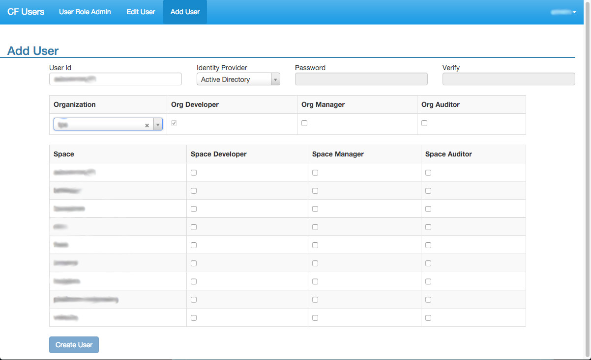

#Cloud Foundry User administration
Cloud Foundry User adminstration UI provides basic CF administration capabilities such as adding a user, and modifying organization and space roles for a user.  This application offers authentication with Cloud Foundry via UAA Oauth integration.  Users are limited to modifying only those things for which their specific assigned roles allow.  This is enforced at both the UI and the backend services that are provided by Cloud Foundry.  

### Creating the Uaa User
Since the application talks to the cloud controller to read/write its information, it needs an admin level account to work correctly.  Install the [uaac cli](https://github.com/cloudfoundry/cf-uaac) and create the account as follows:

##First target your uaac client and authenticate with the following commands:
```
uaac target <uaa_url>
uaac token client get <admin client name> -s <admin client secret>
```

##Create the client with the following uaac commands:
```
uaac client add cf_users_client \
 --authorities scim.write,scim.read,cloud_controller.read,cloud_controller.write,password.write,uaa.admin,uaa.resource,clo
ud_controller.admin \
 --authorized_grant_types authorization_code,client_credentials,password \
 --autoapprove true \
 --scope openid,scim.write,scim.read,cloud_controller.read,cloud_controller.write,password.write,console.admin,console.sup
port,cloud_controller.admin \
 -s <cf_users client secret>
uaac client update cf_users_client --autoapprove true
uaac client update cf_users_client --autoapprove true --authorized_grant_types authorization_code,client_credentials,pass
word,implicit
```


## Login to the Cloud Foundry Client with the following command.
```
cf login --skip-ssl-validation -a <cf api url> -u <admin username> -p <admin password>
```

## Target your the Cloud Foundry organization and space where you plan to deploy the application.
```
cf target -o <organization name> -s <space name>
```

## Create the user provided service for cloud_foundry_api
```
cf cups  cloud_foundry_api -p '{  "alias": "cloud_foundry_api",
                                  "domain": "<domain name for cloud foundry api rest services for example domain.com>",
                                  "uaa-domain":"<domain name for uaa rest services for example uaa.domain.com>",
                                  "login-domain" : "<domain name for login url for authentication for example login.domain.com>",
                                  "uaa-client-id" : "<uaa client id Base64 encoded.>",
                                  "uaa-client-secret" : "<uaa client secret Base64 encoded>",
                                  "portal-admin-id" : "<administrator user id Base64 encoded>",
                                  "portal-admin-pw" : "<administror user password  Base64 encoded>" ,
                                  "default-email-domain" : "<email domain of active directory users for example who@cloudfoundry.com would have an email domain of cloudfoundry.com>",
                                  "saml-provider" : "<saml provider name, this field is optional>" }'
                                  "user-name-type" : "<type of username for users created through cf-users.  email or samaccountname>" }'
                                                             
```
The guids can be retrieved utilizing the uaac users command.

For local development update gulpfile.coffee to set the corresponding values in the VCAP_SERVICES environment variable.

##Deploy The App from the bash command line with the following commands:
```
rm -rf node_modules
npm install --production
npm run package
cf push cf-users -p . --no-start
cf bs cf-users  cloud_foundry_api
cf map-route cf-users <cf domain> -n cf-users
cf start cf-users

```

## Running locally.
  
  Update gulpfile.coffee to set the  values in the VCAP_SERVICES environment variable corresponding to the cloud_foundry_api service configured above.
  
  create and cd to  the certs directory and run the following commands:
  
  openssl genrsa -out localhost.key 1024 

  openssl req -new -key localhost.key -out certrequest.csr

  openssl x509 -req -in certrequest.csr -signkey localhost.key -out localhost.cert
  
  Then run the following commands:
  
  npm install
  npm run dev

## Running unit tests
  To run the tests onetime run the following command: 
  
  npm run test
  
  To run the tests continuously as you work on the code run the following command:
  
  
  npm run test:dev
## <a name="using"></a> Using the CF Users UI



